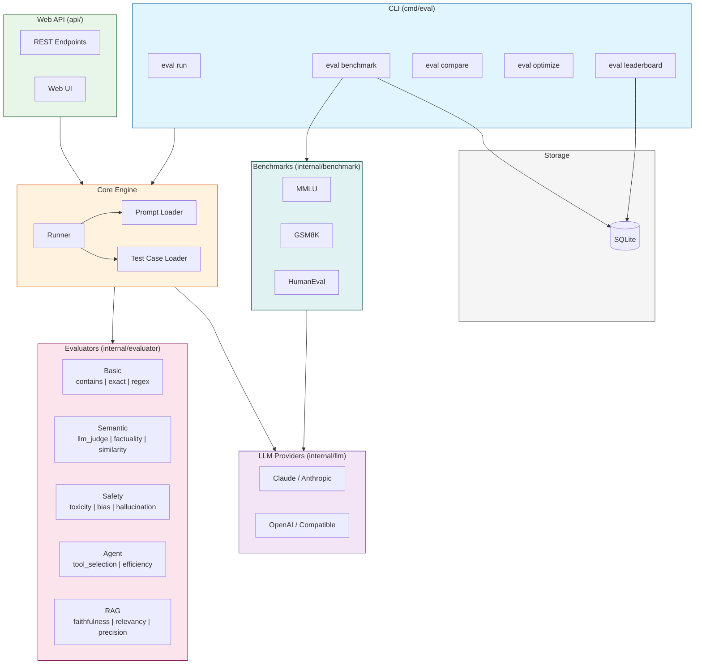
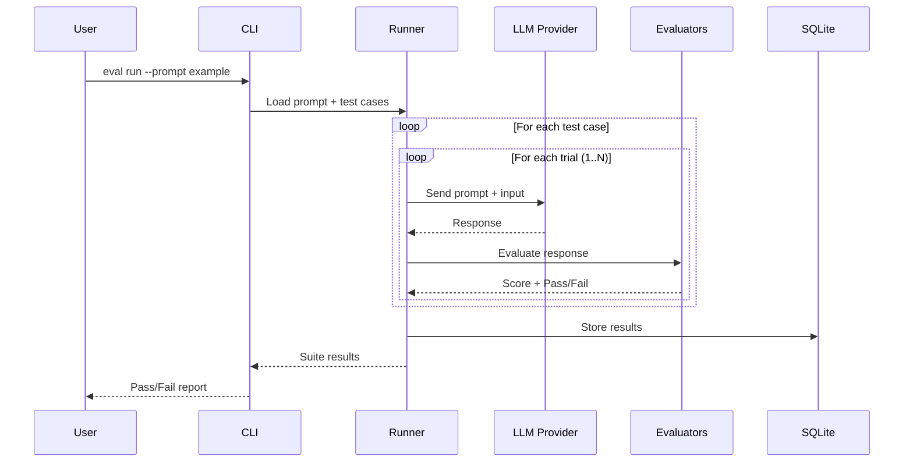
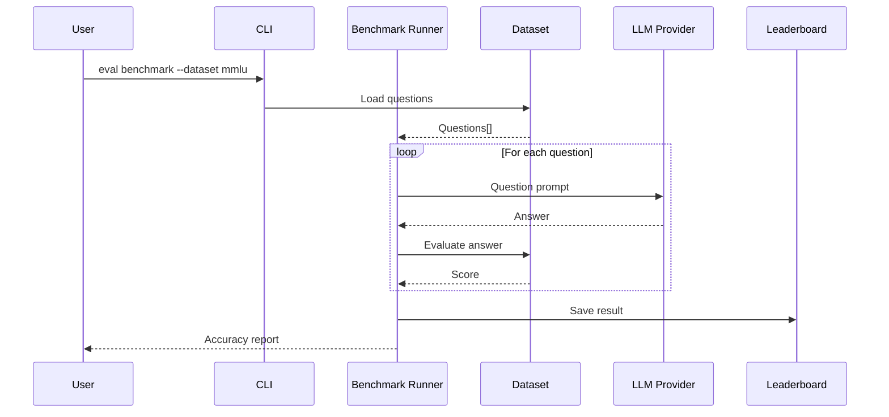

# AI Eval

A comprehensive prompt evaluation and optimization system for LLM applications.

## Features

- **Multi-provider LLM support**: Claude (Anthropic), OpenAI, and compatible APIs
- **Rich evaluator suite**:
  - `llm_judge` - LLM-based response quality scoring
  - `regex`, `contains`, `exact` - Pattern matching evaluators
  - `factuality`, `similarity` - Semantic evaluators
  - `safety`, `agent`, `rag` - Specialized evaluators
- **Benchmark datasets**: MMLU, GSM8K, HumanEval
- **CLI tools**: run, compare, benchmark, optimize, diagnose, leaderboard
- **Web API server** with evaluation endpoints
- **SQLite storage** for results and leaderboard tracking

## Architecture



### Evaluation Flow



### Benchmark Flow



## Installation

```bash
go install github.com/stellarlinkco/ai-eval/cmd/eval@latest
```

Or build from source:

```bash
git clone https://github.com/stellarlinkco/ai-eval.git
cd ai-eval
go build -o eval ./cmd/eval
```

## Configuration

1. Copy the example config:
```bash
cp configs/config.yaml.example configs/config.yaml
```

2. Set API keys via environment variables:
```bash
# Claude
export ANTHROPIC_API_KEY="your-key"
# or
export ANTHROPIC_AUTH_TOKEN="your-token"

# OpenAI
export OPENAI_API_KEY="your-key"
```

3. (Optional) Customize `configs/config.yaml` for base URLs, models, etc.

## Usage

### Run Prompt Evaluation

```bash
# Run evaluation for a specific prompt
eval run --prompt example

# Run with custom trials
eval run --prompt example --trials 5

# Run all prompts
eval run --all
```

### Run Benchmarks

```bash
# MMLU benchmark
eval benchmark --dataset mmlu --sample-size 100

# GSM8K math benchmark
eval benchmark --dataset gsm8k --sample-size 100

# HumanEval code benchmark (requires AI_EVAL_ENABLE_CODE_EXEC=1; defaults to Docker sandbox)
AI_EVAL_ENABLE_CODE_EXEC=1 eval benchmark --dataset humaneval --sample-size 50
AI_EVAL_ENABLE_CODE_EXEC=1 AI_EVAL_SANDBOX_MODE=host eval benchmark --dataset humaneval --sample-size 50 # UNSAFE

# Compare providers
eval benchmark --dataset mmlu --provider claude --model claude-sonnet-4-5-20250929
eval benchmark --dataset mmlu --provider openai --model gpt-4o
```

### View Leaderboard

```bash
eval leaderboard --dataset mmlu
eval leaderboard --dataset gsm8k --top 10
eval leaderboard --dataset humaneval --format json
```

### Compare Prompt Versions

```bash
eval compare --prompt example
```

### Optimize Prompts

```bash
eval optimize --prompt example
```

## Documentation

- [Getting Started](docs/getting-started.md) - Installation and first evaluation
- [Evaluators Guide](docs/evaluators.md) - All evaluator types and usage
- [Benchmarks Guide](docs/benchmarks.md) - Running standardized benchmarks
- [Configuration Reference](docs/configuration.md) - Detailed config options
- [API Reference](docs/api.md) - REST API documentation

## Project Structure

```
ai-eval/
├── cmd/
│   ├── eval/           # CLI application
│   └── server/         # Web API server
├── configs/
│   └── config.yaml.example
├── internal/
│   ├── benchmark/      # MMLU, GSM8K, HumanEval datasets
│   ├── evaluator/      # Evaluator implementations
│   │   ├── agent/      # Agent-specific evaluators
│   │   ├── rag/        # RAG evaluators
│   │   └── safety/     # Safety evaluators
│   ├── llm/            # LLM provider implementations
│   ├── optimizer/      # Prompt optimization
│   ├── runner/         # Test runner
│   └── ...
├── prompts/            # Prompt definitions (YAML)
├── tests/              # Test case definitions (YAML)
└── web/static/         # Web UI
```

## Prompt Definition Format

```yaml
# prompts/example.yaml
name: example
version: "1.0"
is_system_prompt: true
template: |
  You are a helpful assistant.

  User request: {{.user_task}}
```

## Test Case Format

```yaml
# tests/example.yaml
prompt: example
suite: example
cases:
  - id: test-1
    input:
      user_task: "What is 2+2?"
    expected:
      contains:
        - "4"
    evaluators:
      - type: llm_judge
        criteria: "Response should be accurate and concise"
```

## License

This project is licensed under the [GNU Affero General Public License v3.0 (AGPL-3.0)](LICENSE).

This means:
- You can use, modify, and distribute this software
- If you modify and deploy this software as a network service, you must make your source code available
- Any derivative work must also be licensed under AGPL-3.0

### Commercial License

For commercial licensing options that don't require AGPL compliance, please contact:

**Email:** support@stellarlink.co
